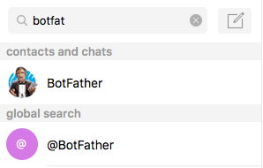
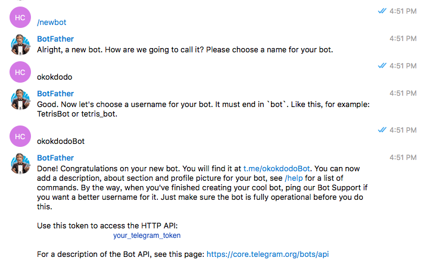
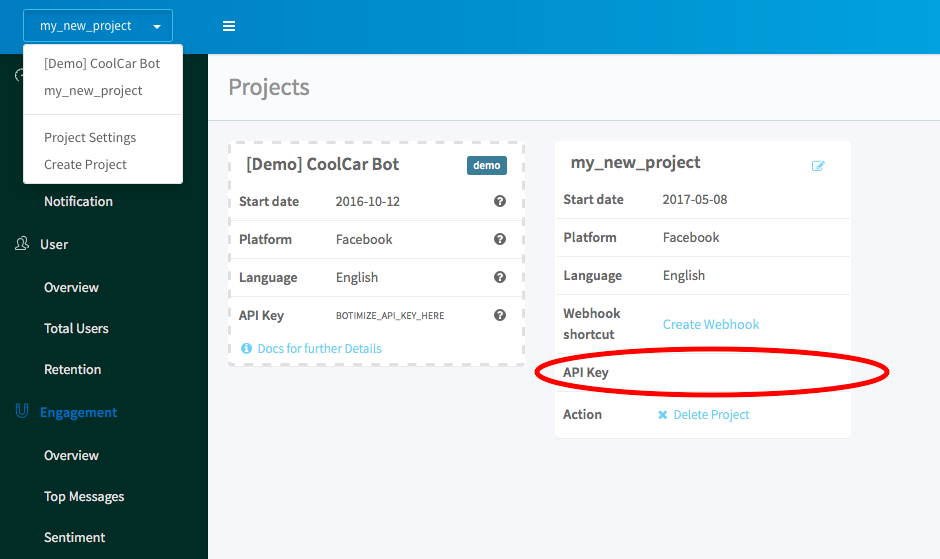

# Create your Telegram bot in Nodejs with botimize bot-analytics service

Here is our 10 min guide to create an echo-bot on telegram with [botimize](http://www.botimize.io) **bot analytic** service.

## Installation

```js
$ npm init
$ npm install telegraf --save
$ npm install botimize
```

## Create a telegram bot and get its token with the aid of botfather

Find botfather by ...

Talk to him like this way and record your telegram token.



## Create a botimize account and a key for the project

Go to [botimize](https://dashboard.botimize.io/register) and create an account.

Create a new project by clicking new project.


See your **YOUR_BOTIMIZE_TOKEN** by clicking Project Setting



## Create a Nodejs bot

Create a Nodejs script (e.g. echoBot.js) and copy this into it. 
Notice you have to replace YOUR_BOT_TOKEN, something like `123456789:AbCdfGhIJKlmNoQQRsTUVwxyZ`.
And also, you have to replace YOUR_BOTIMIZE_TOKEN.
```js
const Telegraf = require('telegraf')

const app = new Telegraf(YOUR_BOT_TOKEN)
const botimize = require('botimize')(YOUR_BOTIMIZE_TOKEN, "telegram")

app.command('start', (ctx) => {
  	ctx.reply('Welcome!')
})

app.on('text', (ctx) => {

        // botimize incoming
        let incomingLog = ctx.update;
        botimize.logIncoming(incomingLog);

        // reply to user
	ctx.reply(ctx.update.message.text);
  
        // botimize outgoing
        let outgoingLog = {
            chat_id: ctx.update.message.chat_id,
            text: ctx.update.message.text,
            token: YOUR_BOT_TOKEN 
        };      
        botimize.logOutgoing(outgoingLog, {parse: 'pure'});
})

app.startPolling()
```

## Talk to your bot

Run on the terminal
```
node echoBot.js
```

Now you can talk to your bot!
I name the bot as okokdodo you can find your bot with the bot name.

